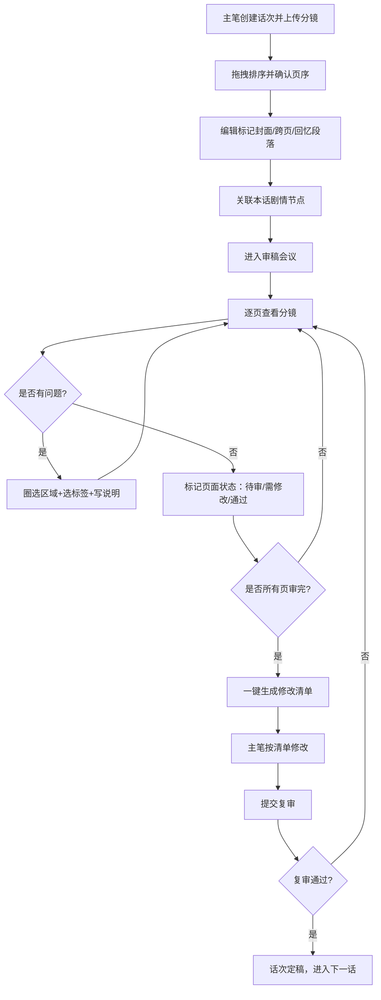

## 1. 产品概述

MangaFlow 是一款面向漫画编辑部与主笔团队的在线分镜会审 Web 应用，旨在将传统的"发文件、拉群聊"式审稿流程升级为可追踪、结构化的专业协作平台。服务于周更连载漫画的远程分镜会审会议，提升团队审稿效率。

- 核心解决问题：分镜稿件散落各处、批注定位困难、修改追踪混乱、审稿状态不透明
- 目标用户：漫画主笔/作者、责任编辑、美术监修、文字编辑
- 产品价值：结构化审稿流程、精准逐格批注、可视化状态流转、一键生成修改清单

## 2. 核心功能

### 2.1 用户角色

| 角色 | 注册方式 | 核心权限 |
|------|----------|----------|
| 主笔/作者 | 账号登录 | 上传分镜、拖拽排序、查看批注、标记修改完成 |
| 责任编辑 | 账号登录 | 审稿标记（封面/跨页/回忆）、逐格批注、状态流转、生成修改清单 |
| 美术监修 | 账号登录 | 逐格批注（美术相关标签）、画面构图反馈 |
| 文字编辑 | 账号登录 | 逐格批注（文字相关标签）、对白位置反馈 |

### 2.2 功能模块

1. **作品与话次管理**：作品列表、话次创建与选择、话次基础信息编辑
2. **分镜上传与页序整理**：图片批量上传、拖拽排序、页码显示、特殊页面标记（封面/跨页/回忆段落）
3. **剧情节点侧边栏**：本话剧情节点列表、与分镜页码关联、审稿时快速参考
4. **逐格批注系统**：画布上圈选问题区域、批注标签选择、多角色批注叠加、批注定位跳转
5. **审稿状态流转**：待审/需修改/复审通过分组视图、单页状态标记、批量操作
6. **修改清单生成**：会议结束一键汇总、按页码分组、按角色分类、导出/复制功能

### 2.3 页面详情

| 页面名称 | 模块名称 | 功能描述 |
|-----------|----------|----------|
| 作品工作台 | 作品列表卡片 | 显示作品封面、标题、最新话次、更新状态、快速进入按钮 |
| 作品工作台 | 新建话次入口 | 创建新话次、输入话次标题、关联剧情节点 |
| 分镜会审主界面 | 顶部导航栏 | 话次选择器、状态筛选Tab、修改清单生成按钮 |
| 分镜会审主界面 | 左侧剧情节点栏 | 可折叠的剧情节点列表、高亮当前页关联节点、跳转功能 |
| 分镜会审主界面 | 中央分镜画布区 | 分镜页网格/列表视图、拖拽排序手柄、页码标签、状态标签、特殊标记徽章 |
| 分镜会审主界面 | 右侧批注面板 | 选中页面的批注列表、新增批注按钮、批注筛选（按角色/标签） |
| 逐格批注弹窗 | 图片画布 | 支持缩放平移、SVG圈选工具、已存在批注高亮显示 |
| 逐格批注弹窗 | 批注表单 | 标签选择（镜头不清/对白遮挡/节奏过快/构图问题/文字错误/其他）、说明输入、角色标识 |
| 状态流转面板 | 分组视图 | 待审/需修改/复审通过三个分组卡片、页缩略图拖拽改变状态 |
| 修改清单弹窗 | 清单总览 | 按页码分组的批注汇总、修改项勾选、完成状态追踪 |
| 修改清单弹窗 | 导出功能 | 复制为文本、导出Markdown、下载图片汇总 |

## 3. 核心流程

### 3.1 主流程描述

主笔上传分镜稿并按页序整理 → 编辑标记特殊页面并关联剧情节点 → 审稿会中各角色逐页添加批注 → 按页标注审稿状态 → 会议结束生成修改清单 → 主笔对照清单修改后提交复审 → 复审通过后进入下一话

### 3.2 Mermaid 流程图

## 4. 用户界面设计

### 4.1 设计风格

**美学方向：编辑部质感 · 深色沉浸模式**

- **主色调**：深炭灰 `#1A1D23`（背景）、象牙白 `#F5F1E8`（文字）、暖赭橙 `#D97757`（主强调色/批注标记）
- **辅助色**：墨蓝绿 `#3D6B6B`（状态通过）、砖红 `#B4523E`（需修改）、米黄 `#E8D5A3`（回忆段落标记）
- **中性色**：采用 zinc 色系配合暖棕调灰，避免冷调工业感
- **按钮风格**：微圆角 6px、轻微悬浮投影、按下有深度反馈；主按钮为暖赭橙实色，次按钮为描边+半透明填充
- **字体方案**：
  - 标题/页码：Noto Serif SC（衬线宋体，带有印刷出版质感）
  - 正文/说明：Noto Sans SC（无衬线黑体，保证可读性）
  - 数字/页码标签：JetBrains Mono（等宽字体，强化工具感）
- **布局风格**：三栏式工作台布局（左剧情节点+中分镜画布+右批注面板），顶栏固定导航，卡片式分组，页面缩略图采用"拍立得"式白色边框+阴影效果
- **图标/emoji风格**：lucide-react 线性图标配合暖色调，批注区域使用手绘风虚线边框，特殊标记（封面/跨页）使用复古印章风格徽章
- **动效设计**：页面切换有轻微淡入位移，拖拽排序时目标位置有线框预览呼吸动画，批注标记添加时有"落针"式弹性动效

### 4.2 页面设计概述

| 页面名称 | 模块名称 | UI 元素 |
|-----------|----------|----------|
| 作品工作台 | 作品卡片 | 大尺寸封面缩略图、作品标题衬线大字号、话次进度条、最近更新时间、暖赭橙"进入审稿"按钮 |
| 分镜会审主界面 | 整体布局 | 深炭灰背景、三栏黄金比例（1:3:1.2）、可拖拽分隔条、顶部象牙白导航栏 |
| 分镜会审主界面 | 分镜页卡片 | 拍立得样式（图片+白色底边+页码）、角标状态色条、特殊标记印章、拖拽把手 |
| 分镜会审主界面 | 剧情节点栏 | 暖棕灰侧栏、竖向时间线节点、当前节点米黄高亮、连接线为虚线 |
| 逐格批注弹窗 | 画布区 | 深色遮罩+象牙白画布框、缩放控制条、手绘风SVG圈选、批注编号标签 |
| 逐格批注弹窗 | 批注标签 | 胶囊式标签、不同问题类型对应不同颜色（镜头=蓝、对白=紫、节奏=橙）、选中态有发光效果 |
| 状态流转面板 | 分组卡片 | 三列并排布局、列标题带状态色标签、卡片可在列间拖拽、拖拽中有半透明预览 |
| 修改清单弹窗 | 清单项 | 页码+缩略图+批注列表嵌套、修改项可勾选已完成、角色标签彩色圆点、导出按钮组 |

### 4.3 响应式设计

- **设计原则**：Desktop-first，最小支持宽度 1280px，平板端（<1024px）采用双栏布局（剧情节点收起为可展开抽屉），移动端（<768px）简化为单栏+底部Tab切换
- **触屏优化**：分镜卡片触控区域扩大至 48x48px，拖拽提供震动反馈（如支持），批注弹窗支持双指缩放图片

### 4.4 视觉细节说明

- 分镜图片采用柔和的投影（`shadow-[0_4px_20px_rgba(0,0,0,0.3)]`），模拟稿件平铺在编辑桌上的层次感
- 批注圈选使用虚线+暖赭橙色，圆圈末端有小圆点，模拟手绘红笔效果
- 页面状态角标使用斜切式小旗子设计，分别为：待审（灰色）、需修改（砖红）、通过（墨蓝绿）
- 回忆段落页面添加淡黄色纸张纹理叠加，封面页有"表纸"印章样式徽章，跨页有左右箭头连接标识
