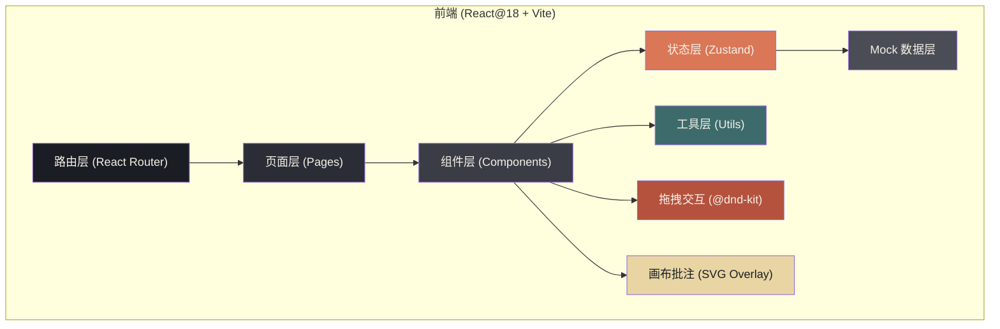
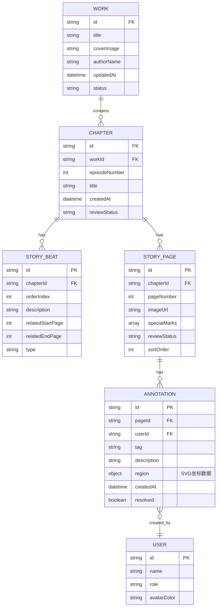

## 1. 架构设计



## 2. 技术描述

- **前端框架**：React@18 + TypeScript@5 + Vite@6
- **初始化工具**：vite-init（React + TypeScript 模板）
- **UI 样式**：TailwindCSS@3 + CSS 变量主题系统
- **路由管理**：React Router DOM@6
- **状态管理**：Zustand@4（分镜、批注、全局状态）
- **拖拽排序**：@dnd-kit/core + @dnd-kit/sortable（页序整理 & 状态流转拖拽）
- **图标库**：lucide-react
- **后端服务**：无后端，纯前端 Mock 数据模拟（localStorage 持久化）
- **图片占位**：使用 picsum.photos / placeholder 生成漫画分格示例图
- **文件上传**：HTML5 File API + FileReader + URL.createObjectURL（本地处理，不上传服务器）

## 3. 路由定义

| 路由路径 | 页面组件 | 功能用途 |
|----------|----------|----------|
| `/` | DashboardPage | 作品工作台首页，展示作品列表卡片 |
| `/works/:workId` | WorkOverviewPage | 作品详情页，展示话次列表与进度 |
| `/works/:workId/chapters/:chapterId` | ReviewBoardPage | **分镜会审主界面** - 三栏式审稿工作台 |
| `/works/:workId/chapters/:chapterId/status` | StatusFlowPage | 审稿状态流转看板视图 |

## 4. 数据模型

### 4.1 实体关系图 (ER Diagram)



### 4.2 TypeScript 类型定义

```typescript
// ============ 用户与角色 ============
export type UserRole = 'author' | 'editor' | 'art_supervisor' | 'text_editor';

export interface User {
  id: string;
  name: string;
  role: UserRole;
  avatarColor: string;
}

// ============ 作品与话次 ============
export interface Work {
  id: string;
  title: string;
  coverImage: string;
  authorName: string;
  updatedAt: string;
  status: 'serializing' | 'completed' | 'hiatus';
  latestEpisode: number;
  totalChapters: number;
}

export interface Chapter {
  id: string;
  workId: string;
  episodeNumber: number;
  title: string;
  createdAt: string;
  reviewStatus: 'draft' | 'reviewing' | 'revising' | 'approved';
}

// ============ 剧情节点 ============
export type StoryBeatType = 'opening' | 'development' | 'climax' | 'recollection' | 'transition' | 'ending';

export interface StoryBeat {
  id: string;
  chapterId: string;
  orderIndex: number;
  description: string;
  relatedStartPage: number;
  relatedEndPage: number;
  type: StoryBeatType;
}

// ============ 分镜页 ============
export type SpecialMark = 'cover' | 'spread_left' | 'spread_right' | 'recollection' | 'color_page';
export type PageReviewStatus = 'pending' | 'needs_revision' | 'approved';

export interface StoryPage {
  id: string;
  chapterId: string;
  pageNumber: number;
  imageUrl: string;
  imageWidth?: number;
  imageHeight?: number;
  specialMarks: SpecialMark[];
  reviewStatus: PageReviewStatus;
  sortOrder: number;
  createdAt: string;
}

// ============ 批注系统 ============
export type AnnotationTag =
  | 'unclear_composition'    // 镜头不清
  | 'dialog_obstruction'      // 对白遮挡
  | 'fast_pacing'             // 节奏过快
  | 'layout_issue'            // 构图问题
  | 'text_error'              // 文字错误
  | 'art_style'               // 画风问题
  | 'continuity'              // 分镜衔接
  | 'other';                  // 其他

export interface AnnotationRegion {
  type: 'circle' | 'rectangle';
  x: number;      // 相对图片百分比 0-100
  y: number;
  width?: number; // rectangle使用
  height?: number;
  radius?: number; // circle使用
}

export interface Annotation {
  id: string;
  pageId: string;
  createdBy: string;       // User.id
  creatorRole: UserRole;
  tag: AnnotationTag;
  description: string;
  region: AnnotationRegion;
  createdAt: string;
  resolved: boolean;
}
```

## 5. 项目目录结构

```
src/
├── components/
│   ├── common/                # 通用UI组件
│   │   ├── Button.tsx
│   │   ├── TagBadge.tsx
│   │   ├── StatusFlag.tsx
│   │   ├── Modal.tsx
│   │   └── SpecialMarkStamp.tsx
│   ├── dashboard/             # 工作台组件
│   │   └── WorkCard.tsx
│   ├── review/                # 会审主界面组件
│   │   ├── TopNavbar.tsx
│   │   ├── StoryBeatSidebar.tsx
│   │   ├── StoryPageGrid.tsx
│   │   ├── StoryPageCard.tsx
│   │   ├── AnnotationPanel.tsx
│   │   ├── FileUploadZone.tsx
│   │   └── AnnotationCanvas.tsx
│   ├── status/                # 状态流转组件
│   │   ├── StatusColumn.tsx
│   │   └── StatusBoard.tsx
│   └── checklist/             # 修改清单组件
│       ├── ChecklistModal.tsx
│       └── ChecklistItem.tsx
├── pages/
│   ├── DashboardPage.tsx
│   ├── WorkOverviewPage.tsx
│   ├── ReviewBoardPage.tsx
│   └── StatusFlowPage.tsx
├── store/                     # Zustand状态管理
│   ├── useAuthStore.ts
│   ├── useWorkStore.ts
│   ├── useChapterStore.ts
│   ├── usePageStore.ts
│   └── useAnnotationStore.ts
├── data/                      # Mock数据
│   ├── mockWorks.ts
│   ├── mockChapters.ts
│   ├── mockStoryBeats.ts
│   ├── mockPages.ts
│   └── mockAnnotations.ts
├── hooks/                     # 自定义Hooks
│   ├── useDragAndDrop.ts
│   ├── useFileUpload.ts
│   └── useAnnotationDrawing.ts
├── utils/                     # 工具函数
│   ├── formatters.ts
│   ├── idGenerator.ts
│   ├── exportChecklist.ts
│   └── tagConfig.ts
├── types/                     # 类型定义
│   └── index.ts
├── App.tsx
├── main.tsx
└── index.css
```

## 6. 状态管理设计

### 6.1 usePageStore（分镜页核心状态）

```typescript
// 核心 actions:
- uploadPages(files: File[]) : Promise<void>   // 批量上传图片
- reorderPages(activeId, overId) : void        // 拖拽重排序号
- updatePageNumber(pageId, newNumber) : void   // 更新页码
- toggleSpecialMark(pageId, mark) : void       // 切换特殊标记
- setPageStatus(pageId, status) : void         // 设置审稿状态
- setPageStatusBatch(pageIds, status) : void   // 批量设置状态
```

### 6.2 useAnnotationStore（批注状态）

```typescript
// 核心 actions:
- addAnnotation(pageId, data) : void           // 添加新批注
- updateAnnotation(id, updates) : void         // 更新批注
- deleteAnnotation(id) : void                  // 删除批注
- resolveAnnotation(id, resolved) : void       // 标记已解决
- filterAnnotations(filters) : Annotation[]    // 筛选批注
```
